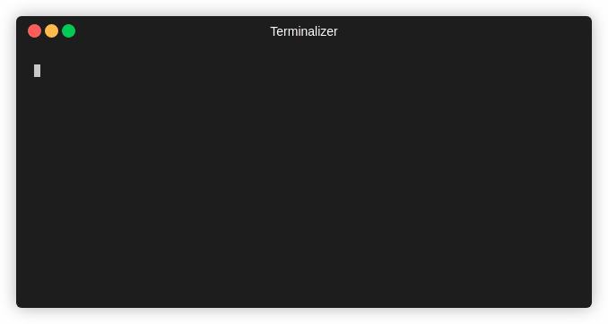

# Mentat
 Blue Team Framework

---
# Note

Mentat is a blue-team framework focused on modularity and portability  
Make file executable first with chmod  

After running the script you'll need to first run the baseline scan  

"check files" allows you to check the specified directory against your baseline and show anything that may have changed  

check login times and users with "check users" 
 
"honey port" sets up a bash honeypot with a fake banner we can customize
The "dirs2watch.txt" file allows you configure which folders you'd like to monitor

---

# Features

Watch for outbound connections

---
# To-Do

Improve nullpit, maybe separate project  
Add (better) documentation  
Port to python

---
# Special Thanks
Credit to /u/dorkpunk for the honeypot module from https://www.reddit.com/r/hacking/comments/1lgqat/an_extremely_simple_honeypot_using_netcat/